# صور مختبر | Mokhtabar screenshots

[العربية](../README.md) · [English](../README.en.md) · [معرض الصور / Image gallery](GALLERY.html)

لقطات فعلية من واجهة مختبر 4.0.0 بدقة مضاعفة، باستخدام مثال محايد لعرض الميزة. لا توجد مشاريع عملاء أو تقارير اختبار. ألوان الصفحات الفاتحة تخص الهوية المختارة داخل المعاينة؛ إطار المختبر دارك ثابت.

Actual screenshots of Mokhtabar 4.0.0 captured at 2× pixel density using a neutral feature example. No client projects or test reports. Light page colors belong to the selected preview identity; the laboratory shell stays dark. Documentation is bilingual; the interface shown is Arabic.

## المختبر على الكمبيوتر | Desktop workspace

سؤال وخيارات ومعاينة واحدة.

One question, its alternatives, and one preview.

## المختبر على الجوال | Phone workspace

السؤال والخيارات أولًا، والتالي ثابت أسفل الشاشة.

Question and options first; Next stays at the bottom.

<a href="../skills/mokhtabar/assets/images/mokhtabar-mobile.png">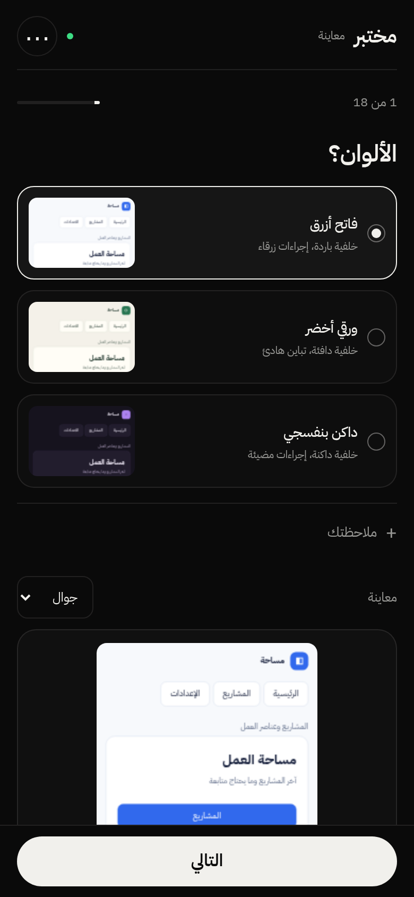</a>

## بدائل تقسيم الصفحة | Page composition alternatives

الخيارات تطبّق التقسيم على محتوى الصفحة الفعلي.

Alternatives apply composition changes to actual page content.

<a href="../skills/mokhtabar/assets/images/mokhtabar-layout.png">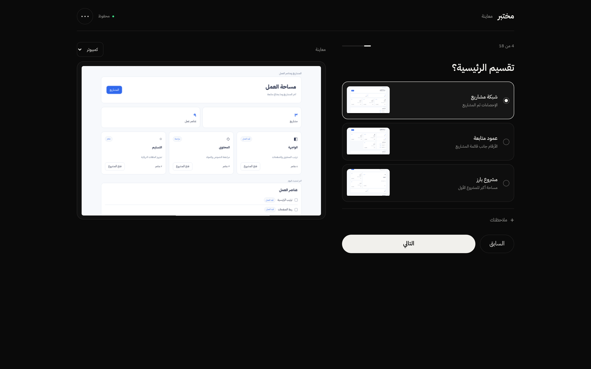</a>

## خريطة الصفحات والأسهم | Page-flow canvas and arrows

ست صفحات وروابط مسماة؛ تظهر نقطة البداية ومسارات الانتقال.

Six pages with labeled connections, an entry point, and navigation paths.

## صفحات الجوال داخل الكانفس | Phone-sized pages on the canvas

الكانفس مفتوح على الكمبيوتر، والمصغرات تستخدم أبعاد صفحات الجوال.

The canvas is open on desktop while its thumbnails use phone viewports.

<a href="../skills/mokhtabar/assets/images/mokhtabar-flow-phone-pages.png">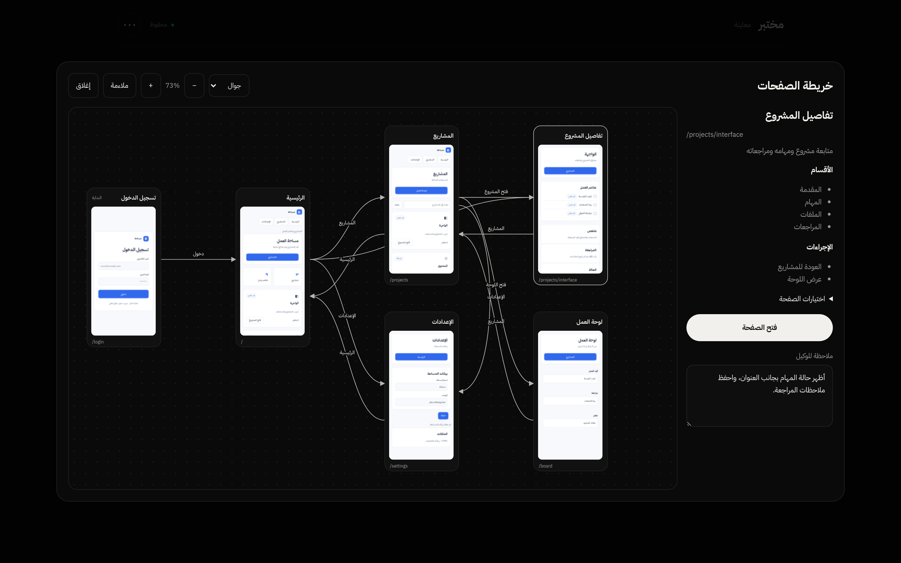</a>

## الكانفس على الجوال | Canvas on a phone

الخريطة متاحة على الجوال مع السحب والتكبير وفتح الصفحة.

The canvas is available on phones with panning, zooming, and page inspection.

<a href="../skills/mokhtabar/assets/images/mokhtabar-flow-mobile.png">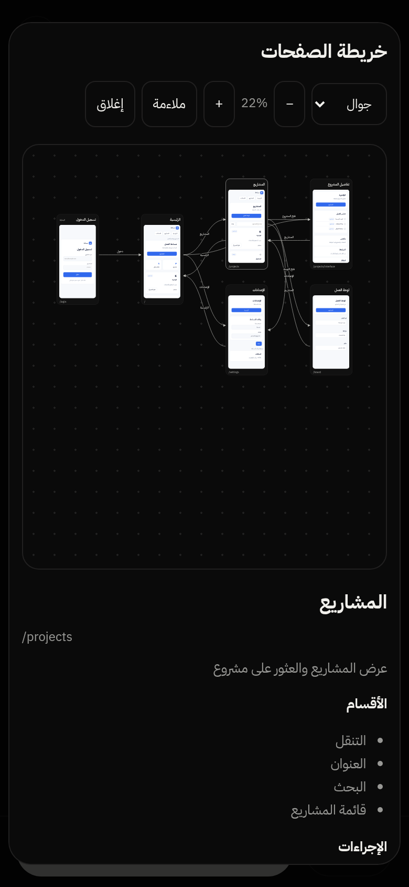</a>

## مواصفات الصفحة وملاحظتها | Page specifications and notes

اختيار عقدة يُظهر الأقسام والإجراءات وملاحظة مستقلة للوكيل.

Selecting a node reveals sections, actions, and a separate note for the agent.

<a href="../skills/mokhtabar/assets/images/mokhtabar-flow-notes.png">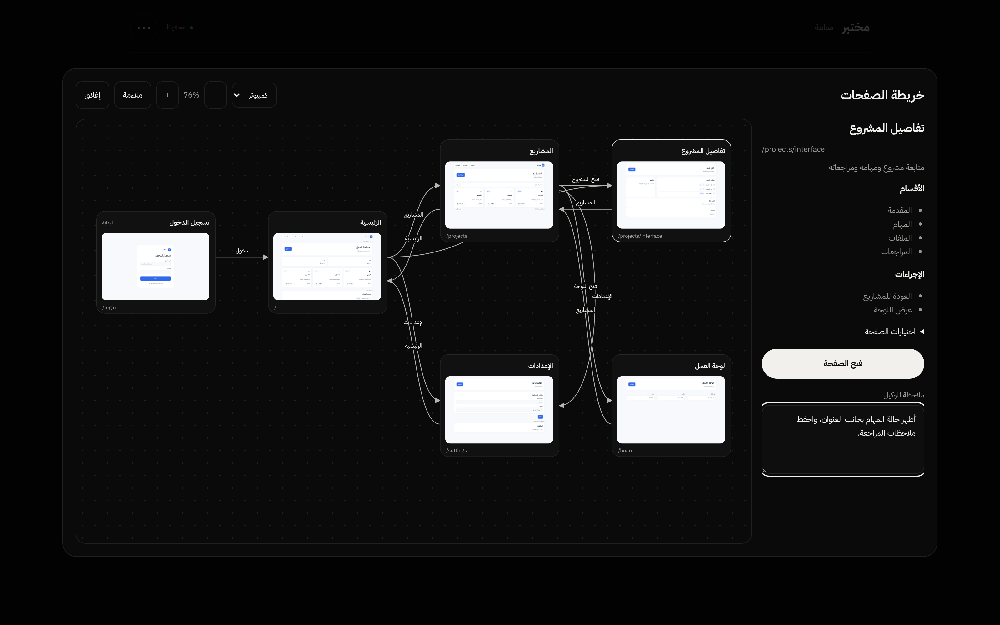</a>

## فتح تسجيل الدخول — كمبيوتر | Inspect login — desktop

صفحة منفردة بقياس 1280×800 مع مواصفاتها. الدخول محاكاة تنقل.

A separate 1280×800 page with specifications. Login simulates navigation.

<a href="../skills/mokhtabar/assets/images/mokhtabar-page-login-desktop.png">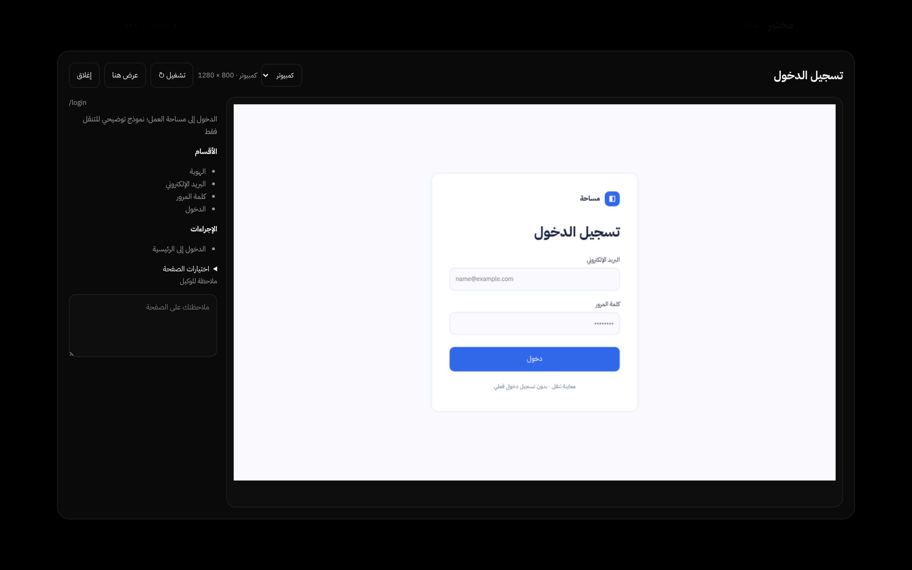</a>

## فتح تسجيل الدخول — جوال | Inspect login — phone

نفس الصفحة بقياس 390×780 داخل واجهة الجوال.

The same page uses a 390×780 viewport inside the phone interface.

<a href="../skills/mokhtabar/assets/images/mokhtabar-page-login-mobile.png">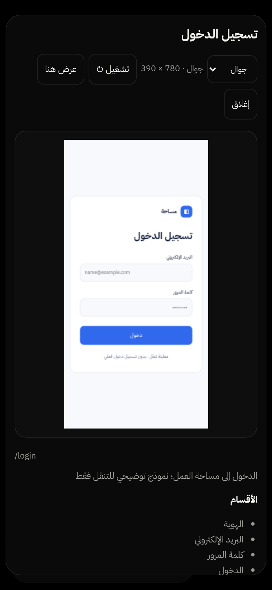</a>

## فتح تفاصيل المشروع — كمبيوتر | Inspect project details — desktop

التصميم الفعلي ومواصفاته وملاحظة الصفحة في نافذة واحدة.

Actual page design, specifications, and its note in one inspection window.

<a href="../skills/mokhtabar/assets/images/mokhtabar-page-detail-desktop.png">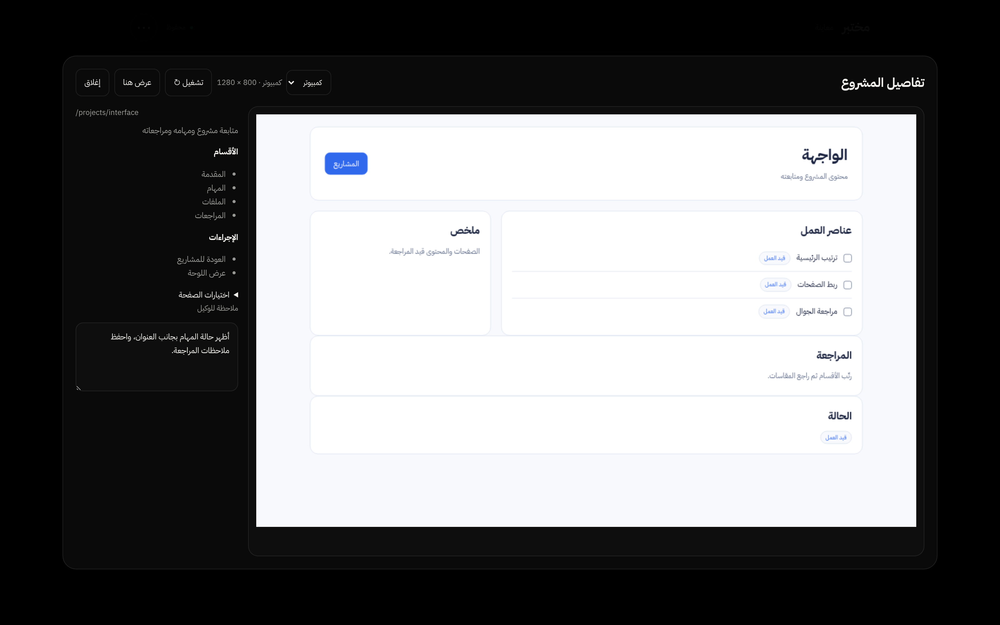</a>

## فتح تفاصيل المشروع — جوال | Inspect project details — phone

معاينة متجاوبة للصفحة منفردة على الجوال.

A responsive, separate page preview on a phone.

<a href="../skills/mokhtabar/assets/images/mokhtabar-page-detail-mobile.png">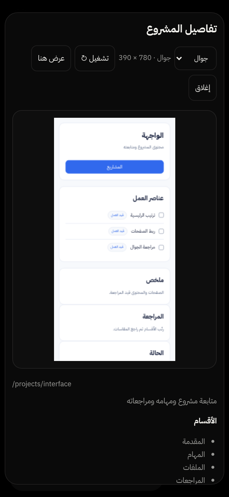</a>

## اختيار الخط | Typography choice

مقارنة الخطوط على محتوى المعاينة نفسه.

Compare fonts on the same preview content.

<a href="../skills/mokhtabar/assets/images/mokhtabar-fonts.png">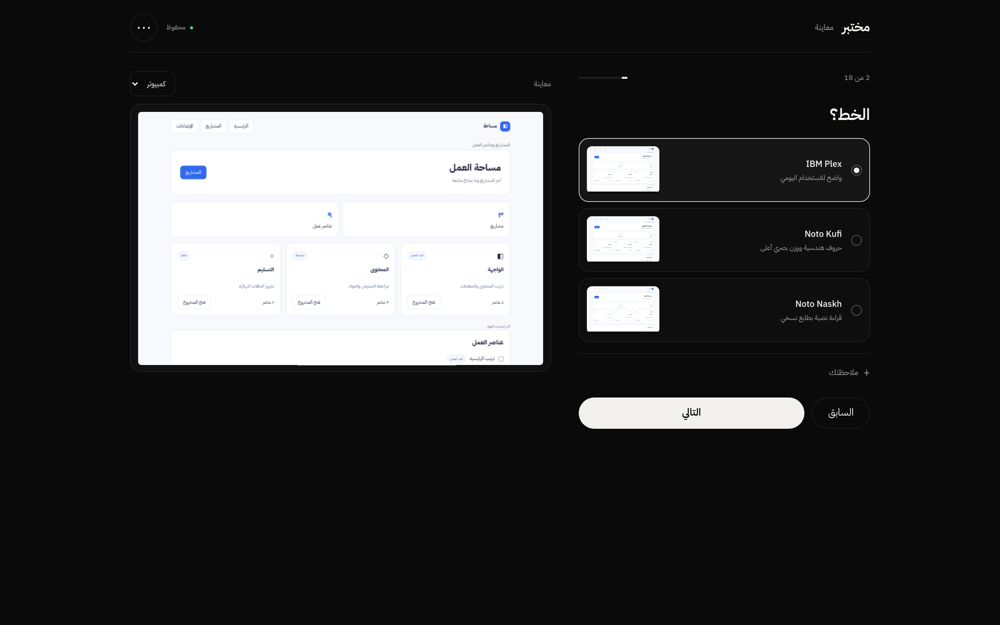</a>

## النص النهائي والنسخ | Final brief and copy

تجميع القرارات والملاحظات ومواصفات التنفيذ في نص قابل للنسخ.

Combine decisions, notes, and implementation specifications into a copyable brief.

<a href="../skills/mokhtabar/assets/images/mokhtabar-export.png">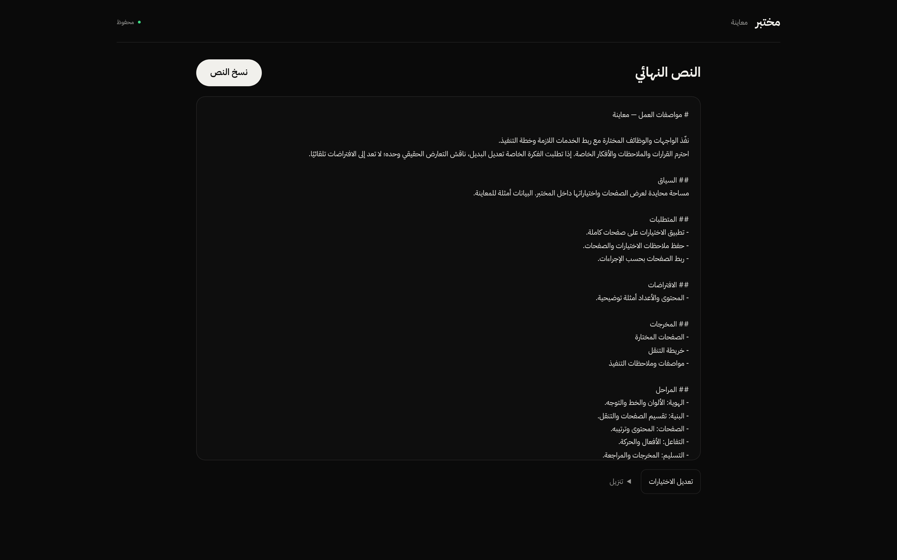</a>

[العرض التفاعلي المحايد / Interactive neutral example](preview.html).
