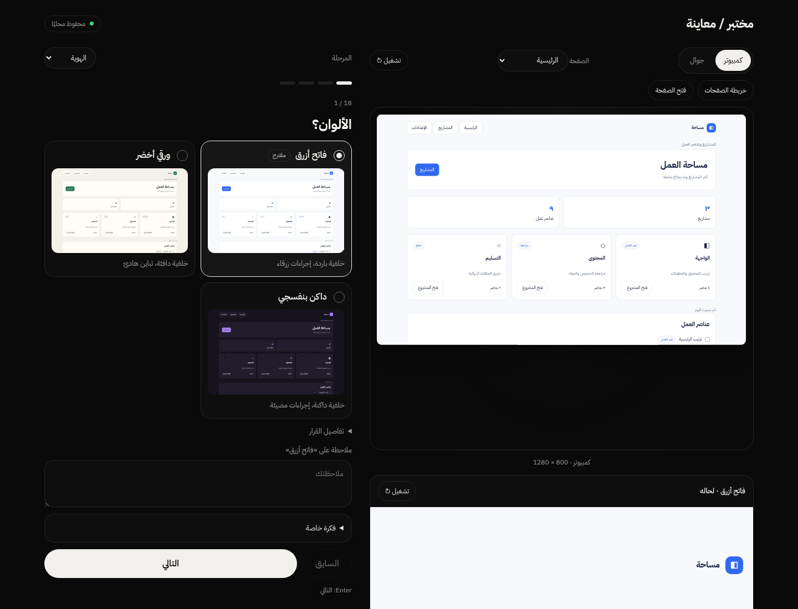
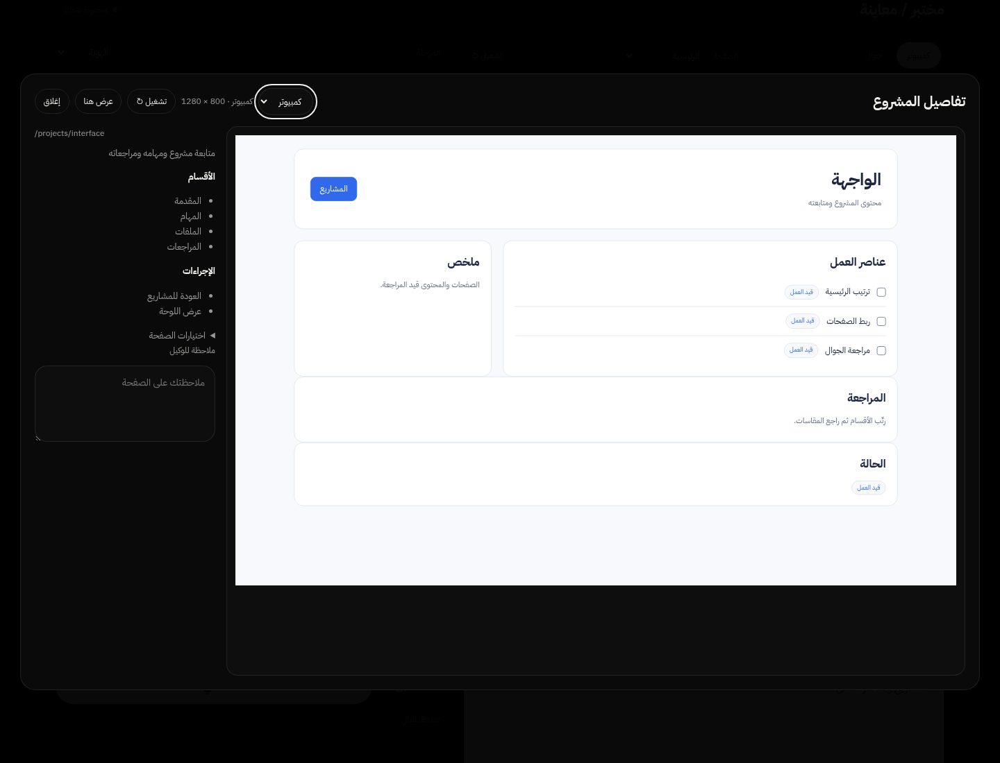

# صور مختبر

صور القالب باستخدام صفحات محايدة؛ لا تعرض مشاريع مستخدمين أو تقارير اختبار.

## اختيار تقسيم فعلي

## هوية جديدة

## الخطوط

## خريطة الصفحات

## الخريطة بقياس الجوال

## صفحة ومواصفاتها

## الجوال

## النص النهائي

[العرض المحايد HTML](preview.html).
