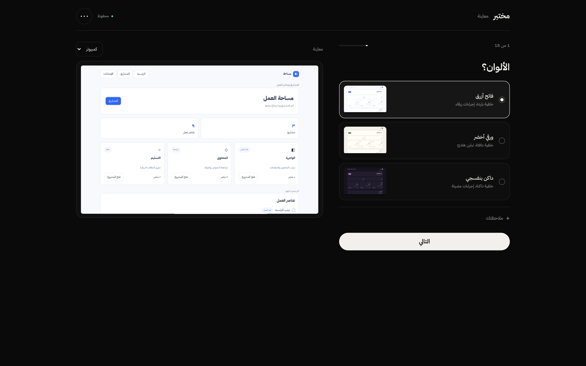
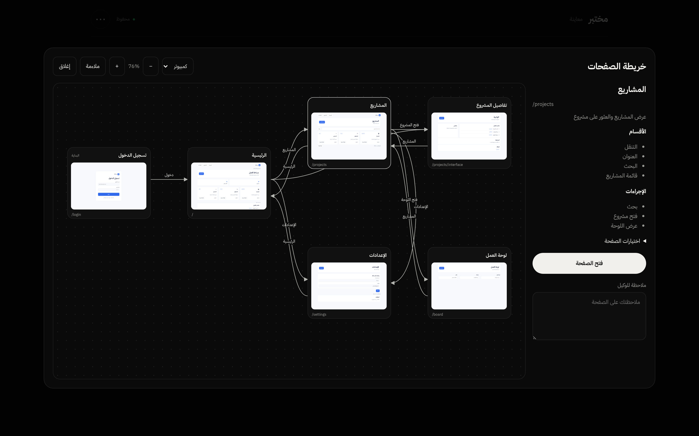

# مختبر

[العربية](README.md) · [English](README.en.md)

سؤال، خيارات، ومعاينة واحدة. يجهّز الوكيل الأسئلة بحسب المشروع؛ المستخدم يجيب ويضغط التالي. إطار المختبر دارك ثابت، وهوية العمل داخله تتبع المشروع.



## رحلة الاستخدام

1. يبدأ السؤال مباشرة، دون اختيار نوع أسئلة أو قسم.
2. تختار بين بدائل فعلية على محتوى المشروع، وتكتب ملاحظتك عند الحاجة.
3. تتابع الأسئلة والفروع المناسبة تلقائيًا.
4. تراجع القرارات ثم تنسخ نص التنفيذ؛ يمكنك تنزيل JSON أو HTML أو النص.

على الجوال تظهر الخيارات أولًا، ويبقى «التالي» ثابتًا أسفل الشاشة. أدوات الصفحات والتفاصيل داخل قائمة ⋯.

## خريطة الصفحات

مصغرات الصفحات ترتبط بأسهم تحمل الأفعال التي تنقلك بينها. حرّك العقد وكبّر الكانفس، ثم افتح أي صفحة وحدها لترى تصميمها ومواصفاتها وتدوّن ملاحظة مستقلة. تتبع أبعاد المعاينات قياس الجوال أو الكمبيوتر المختار.



[الجوال](assets/images/mokhtabar-mobile.png) · [الخريطة بقياسات الجوال](assets/images/mokhtabar-flow-phone-pages.png) · [فتح صفحة وملاحظاتها](assets/images/mokhtabar-page-detail-desktop.png)

## الاستخدام والبناء

انسخ هذا المجلد كاملًا إلى مسار مهارات وكيلك، واقرأ [INSTALL.md](INSTALL.md) و[SKILL.md](SKILL.md). قل: «استخدم مختبر على مشروعي وجهّز الأسئلة المناسبة تلقائيًا».

```bash
python scripts/build.py project.json --out lab.html
python scripts/build.py project.json --selection choices.json --out lab.html
```

الإصدار 4.0.0. Python 3.10+ ومتصفح حديث، دون مكتبات إضافية. عقد البيانات version 3 مع دعم 1/2.

## ما يختاره الوكيل

- للمشروع القائم: معاينة من مصدره الفعلي مع الحفاظ على ألوانه وخطوطه ومحتواه.
- للهوية المفقودة: الألوان والخطوط والتوجه أولًا، ثم قرارات البنية والتفاعل.
- للمواقع والتطبيقات: بدائل تقسيم وتنقل ومكونات وحركة على الصفحات نفسها.
- للموشن والفيديو والخطط والشروح: قرارات ومحتوى ومعاينات مناسبة للمجال؛ لا تُضاف أسئلة غير مرتبطة بالطلب.

## تغييرات 4.0.0

أزيلت قوائم المراحل وأزرار الأسئلة من رحلة الإجابة. بقيت معاينة واحدة، والملاحظات والأدوات اختيارية. تغيير الاختيار لا يمرّر المختبر بعيدًا عن السؤال. تبقى الفروع والحفظ وملاحظات البدائل والصفحات والتصدير.

## حدود الاستخدام

الأسئلة والفروع معدّة مسبقًا بواسطة الوكيل؛ HTML لا يولّد أسئلة جديدة من نموذج داخله. الأفكار المكتوبة تصل للوكيل ولا يعاد رسمها تلقائيًا. الحفظ محلي؛ أرسل النص أو JSON للوكيل لتنفيذ قراراتك. تسجيل الدخول في المثال محاكاة تنقل فقط؛ HTML لا ينفّذ مصادقة أو خدمة خلفية، ولا يصدّر فيديو.

المثال والصور محايدان لعرض المهارة، وليسا مشروع عميل أو تقرير اختبار. الإطار العربي RTL؛ التوثيق متاح باللغتين.

راجع [عقد البيانات](references/v3-contract.md) و[التحقق](references/quality.md). الترخيص [MIT](LICENSE)، مع تراخيص الخطوط المرفقة.
